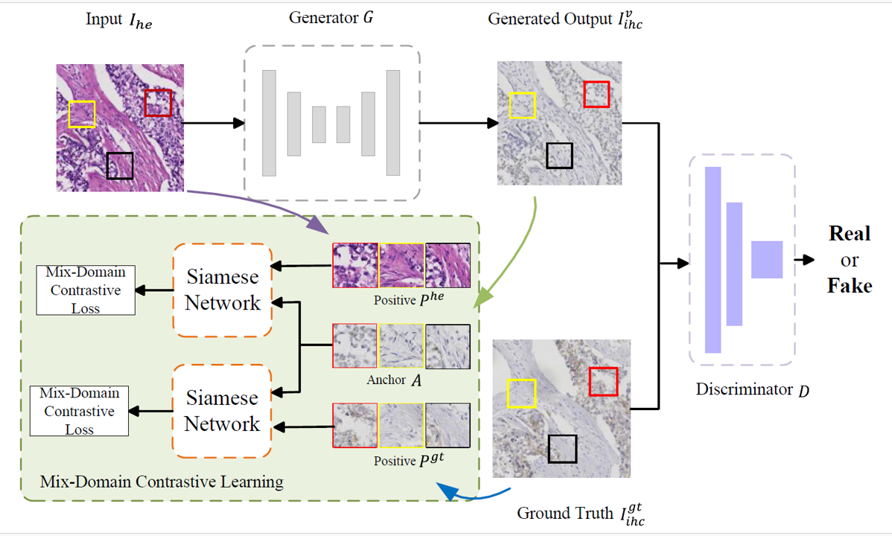
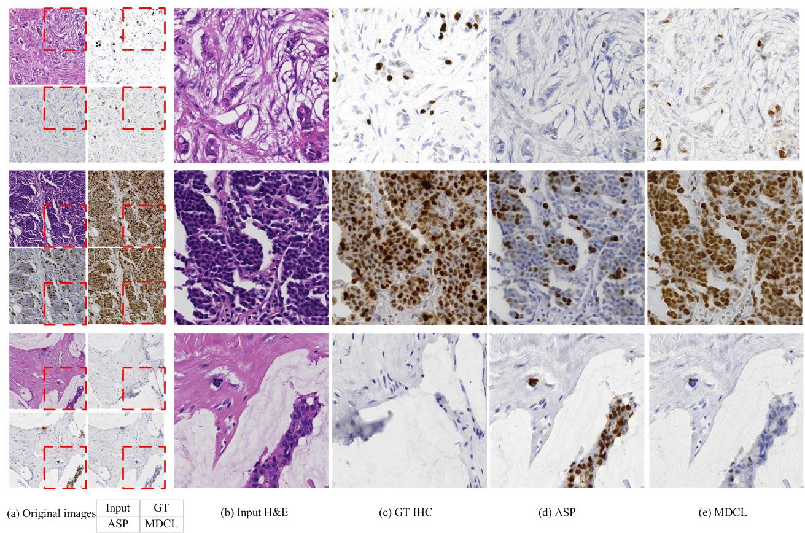

# Mix-Domain Contrastive Learning for Unpaired H\&E-to-IHC Stain Translation (ICIP 2024)
### Song Wang, Zhong Zhang, Huan Yan, Ming Xu, Guanghui Wang

<br>
<p align="center">

</p>
<br>

> H\&E-to-IHC stain translation techniques offer a promising solution for precise cancer diagnosis, especially in low-resource regions where there is a shortage of health professionals and limited access to expensive equipment. Considering the pixel-level misalignment of H\&E-IHC image pairs, current research explores the pathological consistency between patches from the same positions of the image pair. However, most of them overemphasize the correspondence between domains or patches, overlooking the side information provided by the non-corresponding objects. In this paper, we propose a Mix-Domain Contrastive Learning (MDCL) method to leverage the supervision information in unpaired H\&E-to-IHC stain translation. Specifically, the proposed MDCL method aggregates the inter-domain and intra-domain pathology information by estimating the correlation between the anchor patch and all the patches from the matching images, encouraging the network to learn additional contrastive knowledge from mixed domains. With the mix-domain pathology information aggregation, MDCL enhances the pathological consistency between the corresponding patches and the component discrepancy of the patches from the different positions of the generated IHC image. Extensive experiments on two H\&E-to-IHC stain translation datasets, namely MIST and BCI, demonstrate that the proposed method achieves state-of-the-art performance across multiple metrics

## Dataset
The [MIST](https://github.com/lifangda01/AdaptiveSupervisedPatchNCE) and [BCI](https://bupt-ai-cz.github.io/BCI/) datasets can be download. 


## Requirements
We follow [ASP](https://github.com/lifangda01/AdaptiveSupervisedPatchNCE) to set the environment and install the dependencies using:
```bash
conda env create -f environment.yml
```

## Training

To train a model on the MIST dataset:
```bash
python -m experiments mist train 0
```
Since the MIST dataset includes 4 subsets: HER2, PR, ER and Ki67, you can change the path `dataroot="datasets/MIST/HER2/TrainValAB"` in experiments/mist_launcher.py to locate different subsets.

To train a model on the BCI dataset:
```bash
python -m experiments bci train 0
```

## Testing and Evaluation
The following commond can be used for generating IHC images:
```bash
python -m experiments mist test 0
```

Plase note to change the `checkpoint_dir` and the `name` in experiments/mist_launcher.py to load the trained models.

To evaluate the quality of the generated IHC images, you can simply run 
```bash
python evaluate.py
```
## Visualization result

<br>
<p align="center">

</p>
<br>

## Acknowledgement
If you use this code for your research, please cite our [paper](https://arxiv.org/abs/2406.11799).
```bash
@article{wang2024mix,
  title={Mix-Domain Contrastive Learning for Unpaired H\&E-to-IHC Stain Translation},
  author={Wang, Song and Zhang, Zhong and Yan, Huan and Xu, Ming and Wang, Guanghui},
  journal={arXiv preprint arXiv:2406.11799},
  year={2024}
}
```
If you use the original [ASP](https://github.com/lifangda01/AdaptiveSupervisedPatchNCE) model included in this repo, please cite the following paper
```bash
@inproceedings{li2023adaptive,
  title={Adaptive supervised patchnce loss for learning h\&e-to-ihc stain translation with inconsistent groundtruth image pairs},
  author={Li, Fangda and Hu, Zhiqiang and Chen, Wen and Kak, Avinash},
  booktitle={International Conference on Medical Image Computing and Computer-Assisted Intervention},
  pages={632--641},
  year={2023},
  organization={Springer}
}
```

This repo is built upon [AdaptiveSupervisedPatchNCE (ASP)](https://github.com/lifangda01/AdaptiveSupervisedPatchNCE). We thank Fangda Li for sharing the code and dataset.
